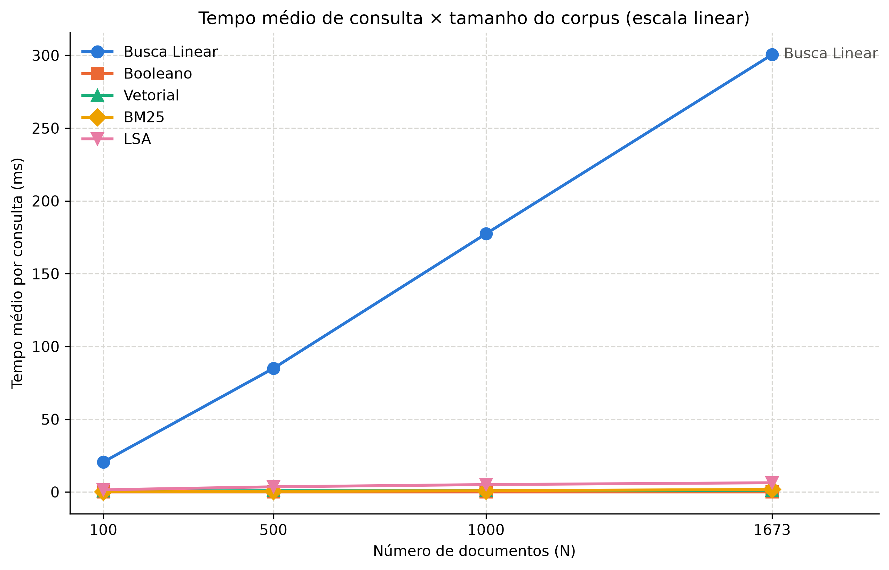
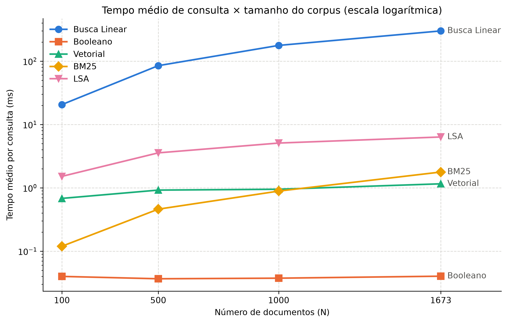

# T1 — Benchmark de Modelos Clássicos de Recuperação da Informação

Trabalho Prático 1 da disciplina de PLN e Sistemas de RI (FUCAPE).

Implementa, compara e avalia cinco algoritmos clássicos de recuperação da informação sobre o
FAQ público do Banco Central do Brasil (domínio de finanças e regulação bancária):

1. Busca Linear Ingênua (baseline O(N), sem índice)
2. Modelo Booleano (matriz de incidência com operações bitwise)
3. Modelo Vetorial (TF-IDF + similaridade do cosseno)
4. Okapi BM25 (`k1` e `b` parametrizáveis)
5. LSA (`TruncatedSVD` sobre a matriz TF-IDF)

## Dataset

[`MTEB-BR/faq-bacen`](https://huggingface.co/datasets/MTEB-BR/faq-bacen) no HuggingFace,
licença **Apache-2.0**: perguntas e respostas do FAQ público do Banco Central do Brasil.

| Conjunto | Tamanho | Observação |
|---|---:|---|
| `corpus` | 1.673 documentos | as respostas do FAQ; `title` vazio em todos, só `text` é usado |
| `queries` | 373 perguntas | usadas na avaliação de relevância e no benchmark |
| `qrels` | 373 pares | todos com `score = 1`: **exatamente 1 documento relevante por pergunta** |

O download é feito por `src/dados.py` na primeira execução e fica em cache em `data/raw/`
(parquets). A Busca Linear lê os documentos de `data/processed/documentos/<_id>.txt`, gerados
automaticamente. As duas pastas estão no `.gitignore`.

## Instalação

### Pré-requisitos

- **Python 3.13** (versão usada no desenvolvimento).
- **Git**, para clonar o repositório.
- **Internet na primeira execução**, para baixar o dataset do HuggingFace e as stopwords em
  português do nltk. Depois disso tudo funciona offline.

### Passo a passo

Todos os comandos abaixo são executados **na raiz do projeto**.

**1. Clonar o repositório**

```bash
git clone https://github.com/Ccesconetto01/t1_pln_ri.git
cd t1_pln_ri
```

**2. Criar um ambiente virtual isolado** (evita conflito com outras bibliotecas da máquina)

```bash
python -m venv .venv
```

**3. Ativar o ambiente virtual**

```bash
.venv\Scripts\activate          # Windows (PowerShell ou cmd)
# source .venv/bin/activate     # Linux/macOS
```

Com o ambiente ativo, o terminal mostra `(.venv)` no início da linha. **Repita este passo a
cada novo terminal**: é ele que faz o comando `python` usar as bibliotecas do projeto.

**4. Instalar as dependências**

```bash
pip install -r requirements.txt
```

Isso instala, com as versões fixadas, `numpy`, `pandas`, `scikit-learn`, `rank-bm25`, `nltk`,
`matplotlib`, `datasets` (traz o `huggingface_hub`, usado no download), `pyarrow`, `pytest`,
`flake8` e `ipykernel`.

**5. Conferir a instalação**

```bash
pytest -q
```

Todos os testes devem passar. Eles usam um mini-corpus fixo e não precisam de internet nem do
dataset.

### Dados e stopwords

Não é preciso baixar nada à mão. Na primeira execução da demo, do benchmark ou do notebook,
o projeto baixa sozinho o dataset (para `data/raw/`) e as stopwords do nltk. Sem internet, o
pré-processamento usa uma lista de stopwords de reserva (`STOP_WORDS_FALLBACK`), mas o dataset
continua sendo necessário na primeira vez.

### Notebook (Jupyter / VS Code)

O `ipykernel` já vem no `requirements.txt`. Ao abrir `notebooks/02_analise_relevancia.ipynb`,
escolha como kernel o Python do ambiente `.venv` (no VS Code: *Select Kernel → Python
Environments → `.venv`*). Em outra máquina, crie e ative o `.venv` e instale as dependências
antes de abrir o notebook. Para registrar o ambiente no Jupyter:

```bash
python -m ipykernel install --user --name t1_pln_ri
```

### Problemas comuns

| Erro | Causa provável | Solução |
|---|---|---|
| `ModuleNotFoundError: No module named 'nltk'` (ou `sklearn`, `pandas`, ...) | O `python` usado não é o do `.venv` | Ativar o `.venv` (passo 3) e rodar `pip install -r requirements.txt` (passo 4) |
| `.venv\Scripts\activate` bloqueado no PowerShell ("execução de scripts desabilitada") | Política de execução do Windows | `Set-ExecutionPolicy -Scope Process -ExecutionPolicy Bypass` e ativar de novo |
| Erro ao baixar o dataset | Sem internet na primeira execução | Conectar-se à internet e rodar de novo |
| `pytest` ou `python` não encontrados | Ambiente não ativado | Ativar o `.venv` (passo 3) |

Para saber qual Python está em uso: `python -c "import sys; print(sys.executable)"` deve
apontar para dentro da pasta `.venv` do projeto.

## Arquitetura

```text
src/
├── preprocessamento.py  # tokenizar_e_filtrar: minúsculas, sem acentos, sem stopwords/números
├── dados.py             # download, cache, montagem de documentos/consultas/qrels, amostragem
├── busca_linear.py      # Busca Linear: relê e tokeniza cada .txt do disco a cada consulta
├── modelo_booleano.py   # Booleano: matriz de incidência (numpy bool) + AND/OR/NOT bitwise
├── modelo_vetorial.py   # Vetorial: TfidfVectorizer (TF sublinear) + cosseno
├── modelo_bm25.py       # BM25: rank_bm25.BM25Okapi, k1 = 1,5 e b = 0,75 por padrão
├── modelo_lsa.py        # LSA: TruncatedSVD (até 100 componentes) sobre a matriz TF-IDF
├── buscador.py          # interface comum (Protocol ModeloBusca) e fábrica dos 5 modelos
└── avaliacao.py         # MRR@k e Recall@k sobre os qrels
benchmark/               # scripts de latência, gráficos e relevância; saídas em resultados/
notebooks/               # análise de relevância com as consultas desafiadoras
tests/                   # pytest com mini-corpus fixo (conftest.py), sem internet
demo.py                  # demo interativa no terminal
```

Os cinco modelos seguem a mesma interface, definida pelo Protocol `ModeloBusca` em
`src/buscador.py`:

```python
modelo.indexar(documentos)            # documentos: dict[_id, texto]
modelo.buscar(consulta, k) -> list[tuple[_id, score]]   # ordem decrescente de score
```

A demo, o benchmark e o notebook criam os modelos apenas por `criar_modelo(nome)` e
`indexar_todos(documentos)`, sem importar as classes diretamente. Todos usam o mesmo
`tokenizar_e_filtrar`, então as diferenças de resultado vêm só do modelo, e não do
pré-processamento. Busca Linear e Booleano não ranqueiam: devolvem score fixo 1,0 na ordem
do corpus.

## Como executar

### Demo

A demo é interativa e roda no terminal, a partir da raiz do projeto:

```bash
python demo.py
```

Na primeira execução ela baixa o dataset para `data/raw/` (é preciso ter internet); depois
disso funciona offline. Ao iniciar, ela indexa os cinco modelos sobre o corpus completo e mostra
o tempo de cada indexação. Em seguida:

- escolha um modelo (número ou nome) ou **Todos** (Enter);
- digite a consulta: a demo mostra o Top-5 de cada modelo com posição, trecho do documento e score;
- no modelo **Booleano** use `AND`, `OR` e `NOT` em maiúsculas (ex.: `pix AND limite`); sem
  operadores, todos os termos são exigidos (o mesmo vale para a **Busca Linear**);
- digite `:modelo` para trocar de modelo e `sair` (ou `Ctrl+C`) para encerrar.

### Testes

```bash
pytest -q
```

Os testes usam um mini-corpus fixo (`tests/conftest.py`) e não dependem de internet nem do
dataset.

### Benchmark de latência e relevância

```bash
python -m benchmark.benchmark_latencia      # gera latencia.csv (leva alguns minutos)
python -m benchmark.graficos_latencia       # gera os 2 PNGs a partir do CSV
python -m benchmark.avaliacao_relevancia    # gera relevancia.csv
```

As saídas ficam em `benchmark/resultados/`. Metodologia da latência:

- **N = 100, 500, 1.000 e 1.673.** O último é o **tamanho real do corpus**: não há como medir
  acima disso sem inventar documentos. Os outros três cobrem uma ordem de grandeza abaixo dele,
  o suficiente para ver a forma da curva. Os subconjuntos são aninhados (100 ⊂ 500 ⊂ 1.000 ⊂
  1.673), sorteados uma vez com semente 42.
- **50 consultas** sorteadas das 373 (semente 42), as mesmas para todo N e todo modelo.
- **Indexação:** mediana de 3 indexações, com um modelo novo a cada vez.
- **Consulta:** 3 consultas de aquecimento; depois cada uma das 50 roda 3 vezes com
  `time.perf_counter()` (150 medições por modelo e N).

Os valores absolutos dependem da máquina. O que importa é como cada modelo cresce com N.

### Notebooks

`notebooks/02_analise_relevancia.ipynb` compara Vetorial, BM25 e LSA lado a lado em cinco
consultas desafiadoras (termo frequente, termo raro, sinônimo, polissemia e termo fora do
vocabulário) e mostra as métricas. Ele já está salvo com as saídas executadas. Para rodar de
novo, abra no VS Code (ou no Jupyter) e escolha o kernel do `.venv` do projeto; o `ipykernel`
já está no `requirements.txt`. O notebook muda sozinho para a raiz do projeto.

## Resultados

Todos os números vêm de `benchmark/resultados/latencia.csv` e `relevancia.csv`, medidos no
Windows 11 com Python 3.13. A análise completa está em
[`docs/analise_parte2.md`](docs/analise_parte2.md), e as consultas desafiadoras estão no
notebook.

### Latência de consulta

Tempo médio por consulta (ms). Entre N = 100 e N = 1.673, N cresce **16,7×**.

| Modelo | N=100 | N=500 | N=1.000 | N=1.673 | Crescimento |
|---|---:|---:|---:|---:|---:|
| Busca Linear | 20,64 | 84,95 | 177,44 | 300,55 | 14,6× |
| Booleano | 0,040 | 0,037 | 0,038 | 0,040 | 1,0× |
| Vetorial | 0,68 | 0,92 | 0,95 | 1,16 | 1,7× |
| BM25 | 0,12 | 0,46 | 0,89 | 1,78 | 14,9× |
| LSA | 1,52 | 3,57 | 5,10 | 6,36 | 4,2× |




### Latência de indexação

Mediana de 3 indexações (ms):

| Modelo | N=100 | N=500 | N=1.000 | N=1.673 | Crescimento |
|---|---:|---:|---:|---:|---:|
| Busca Linear | 0,002 | 0,002 | 0,004 | 0,006 | não indexa: só guarda os ids |
| Booleano | 12,1 | 39,3 | 82,8 | 143,5 | 11,9× |
| Vetorial | 16,7 | 42,0 | 84,5 | 137,6 | 8,3× |
| BM25 | 10,8 | 39,6 | 84,3 | 129,8 | 12,0× |
| LSA | 112,0 | 221,2 | 357,1 | 575,3 | 5,1× |

### Complexidade teórica × observada (consulta)

| Modelo | Teórica | Observada |
|---|---|---|
| Busca Linear | O(N · L): relê e tokeniza cada documento do disco | **Linear** (14,6×) e de longe a mais lenta: ~300 ms com o corpus inteiro, dominada por I/O e tokenização |
| Booleano | O(\|q\| · N): AND bit a bit sobre vetores de N posições | **Praticamente constante**: operação vetorizada no numpy sobre ≤ 1.673 booleanos; o custo fixo do Python domina |
| Vetorial | O(\|q\|) para vetorizar + O(nnz) no cosseno esparso | Cresce só 1,7×: o custo fixo do `transform` do scikit-learn ainda domina nesse tamanho |
| BM25 | O(\|q\| · N): `get_scores` pontua **todos** os documentos | **Quase exatamente linear** (14,9×). Empata com o Vetorial em N = 1.000 e fica mais lento em N = 1.673 |
| LSA | O(\|q\| · k) na projeção + O(N · k) no cosseno denso (k ≤ 100) | Cresce 4,2×: linear em N somado a um custo fixo maior (a projeção pelo SVD) |

**Achado principal: ter índice não garante consulta sublinear.** BM25, Vetorial e LSA
calculam um score para todos os N documentos a cada consulta, antes de ordenar o Top-k. O
índice elimina a releitura e a retokenização (com N = 1.673 a Busca Linear é ~170× mais lenta
que o BM25), mas não elimina a varredura. Para ficar sublinear seria preciso percorrer só as
listas invertidas dos termos da consulta, ou usar poda do tipo WAND/MaxScore. Na indexação,
Booleano, Vetorial e BM25 crescem de forma aproximadamente linear (a tokenização domina); o
LSA é o mais caro (~4× os demais com N = 1.673) por causa do `TruncatedSVD`.

### Relevância (373 consultas, corpus completo)

| Modelo | MRR@10 | Recall@10 |
|---|---:|---:|
| **BM25** (k1 = 1,5; b = 0,75) | **0,4041** | **0,6381** |
| Vetorial (TF-IDF + cosseno) | 0,3768 | 0,6059 |
| BM25 (b = 0) | 0,3511 | 0,5576 |
| LSA (100 componentes) | 0,2407 | 0,5201 |

Como cada pergunta tem um único relevante, o Recall@10 é a fração de perguntas cuja resposta
certa aparece no Top-10.

- **BM25 é o melhor** nas duas métricas: acerta no Top-10 em 63,8% das perguntas.
- **Efeito de `b`:** sem normalização por comprimento (`b = 0`), o MRR@10 cai de 0,404 para
  0,351 e o Recall@10 de 63,8% para 55,8%, abaixo até do Vetorial.
- **LSA é o pior.** Nas consultas desafiadoras ele perde termos raros e específicos: em
  "atendimento prioritário para idosos e gestantes" não traz o único documento com "idosos" e
  "gestantes", que Vetorial e BM25 põem em 1º.
- **Booleano e Busca Linear ficam fora das métricas** porque não ranqueiam e exigem todos os
  termos. Com perguntas em linguagem natural, o Booleano só retorna algo em 56 das 373 (15%).

Resumo das consultas desafiadoras (Top-5 completo no notebook):

| Tipo | Consulta | O que aconteceu |
|---|---|---|
| Termo frequente | "o banco pode cobrar" | Vetorial e BM25: mesmo Top-5, guiado por "cobrar" (26 docs). LSA traz cheque cruzado |
| Termo raro | "atendimento prioritário para idosos e gestantes" | Vetorial e BM25 acertam em 1º; o LSA não traz o documento |
| Sinônimo | "empréstimo para comprar casa" | Nenhum acerta. Os lexicais trazem "Casa da Moeda"; o LSA traz consignado |
| Polissemia | "como pagar a conta de luz" | Só o Vetorial põe a resposta em 1º; o BM25 a põe em 3º; o LSA fica em "conta bancária" |
| Fora do vocabulário | "bitcoin é regulado pelo banco central?" | Nenhum acerta: "bitcoin" não existe no corpus ("criptoativos"/"moedas virtuais") |

## Limitações

- **N máximo = 1.673**, o corpus inteiro. Em N maiores os custos fixos (Booleano, Vetorial)
  devem perder peso para a parte linear, mas isso não foi medido.
- **Uma única máquina** e uma única execução do benchmark. Os valores absolutos mudam com o
  hardware; o desvio padrão está no CSV.
- **Um relevante por consulta** nos qrels. Um documento igualmente útil, mas não anotado,
  conta como erro, o que tende a subestimar todos os modelos.
- **Busca Linear e Booleano não ranqueiam** (score fixo, ordem do corpus), então não entram
  em MRR@10 e Recall@10.
- **Sem tratamento de sinônimos nem de termos fora do vocabulário.** Os modelos lexicais só
  casam palavras idênticas (após remover acentos), e o LSA só relaciona termos que já
  aparecem no corpus. Não há stemming, então variações como "cobrar"/"cobrança" também não
  se casam.
- **Consulta O(N) em BM25, Vetorial e LSA**, pelas bibliotecas usadas (sem percorrer listas
  invertidas nem usar poda WAND/MaxScore).
